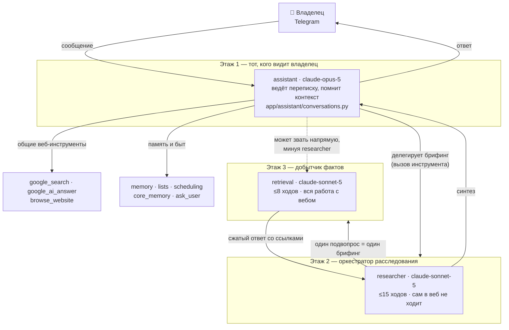
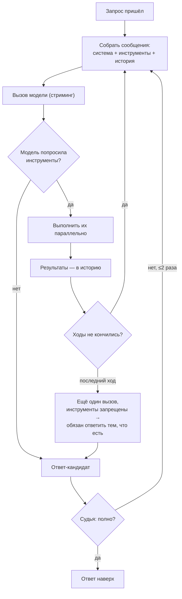
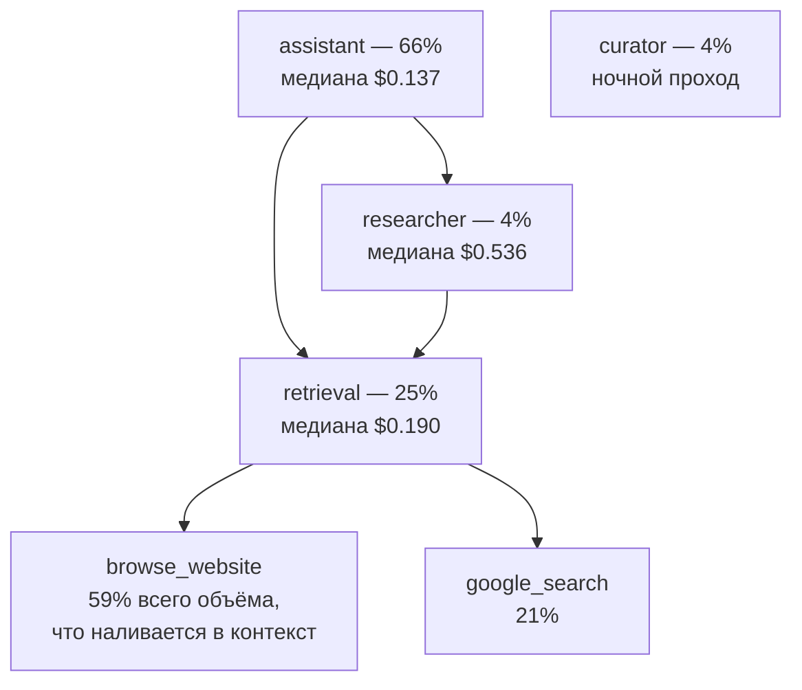

# Как рождается ответ: кто кого зовёт

Схема того, что происходит между сообщением владельца и ответом. Конкретные значения (модели,
лимиты ходов, состав инструментов) живут в коде и меняются — здесь они стоят как ориентир, а
источник правды указан рядом: `app/assistant/conversations.py`, `app/subagents/agents.yml`,
`app/subagents/tool.py`.

## 1. Общая картина: три этажа, и только один говорит с владельцем

Ключевое свойство: **вложенность ограничена одним уровнем**. Инструменты верхнего уровня получают
список всех конфигов как «соседей», а их дети — пустой список, поэтому `retrieval` уже никому
делегировать не может (`SubagentTool._child`).

## 2. Кто каким инструментом владеет

Разделение не случайное: у основного агента схема инструментов уходит в каждый запрос, поэтому на
нём только общие веб-инструменты, а специализированные листья SerpApi достижимы **только** через
`retrieval`.

```mermaid
flowchart LR
    subgraph MAIN["assistant — MAIN_TOOLS"]
        direction TB
        M1["google_search"]
        M2["google_ai_answer"]
        M3["browse_website"]
        M4["memory · lists · scheduling<br/>core_memory · ask_user"]
    end

    subgraph RES["researcher — 3 инструмента"]
        direction TB
        R1["retrieval ← сосед"]
        R2["hypothesis_tree"]
        R3["short_term (working_note)"]
    end

    subgraph RETR["retrieval — 16 инструментов"]
        direction TB
        T1["google_search · google_ai_answer · google_news"]
        T2["google_maps_search · google_maps_reviews"]
        T3["google_hotels · google_flights · google_events"]
        T4["google_finance · google_scholar · google_jobs"]
        T5["amazon_search · amazon_product"]
        T6["youtube_search · youtube_transcript"]
        T7["browse_website"]
    end

    MAIN -.->|делегирование| RES
    MAIN -.->|делегирование| RETR
    RES -->|делегирование| RETR
```

`hypothesis_tree` намеренно отсутствует у основного агента: он нужен только тому, кто ведёт
расследование.

## 3. Что происходит внутри одного агента за один вызов

Одинаково для всех трёх — это один и тот же цикл из `baski.agents.Agent`.

Судья у каждого агента свой: у `assistant` — `CuratedJudge` с рубрикой этого чата (её правит ночной
куратор), у субагентов — `GeminiJudge` с рубрикой из их конфига.

**Судья проверяет форму и отзывчивость, но не факты** — он не открывает ссылки. Выдуманное число с
правдоподобной ссылкой проходит его насквозь.

## 4. Куда при этом уходят деньги

Замер за 30 дней (`PRICING.md`, 531 прогон, $103.70). Доля — от всего счёта.

Читать так: 55% счёта — это **запись в кэш**, то есть первая укладка нового текста в контекст. Что
туда наливается — видно на нижнем ряду: один `browse_website` отвечает почти за 60%.

## 5. Что из этого следует для замены модели

`retrieval` — единственная крупная статья, где подмену модели можно **проверить**: у него узкий вход
(один самодостаточный брифинг), узкий выход (сжатый ответ со ссылками) и отдельный судья. Он не
разговаривает с владельцем и не решает, какие подвопросы задавать.

Но по схеме видно и опасность: его ответ идёт наверх через `researcher` к владельцу, а **ни один
судья по пути не открывает ссылки**. Значит переход требует не только цены и качества, но и
детектора выдумок — см. `docs/retrieval-on-a-gateway.md`.
